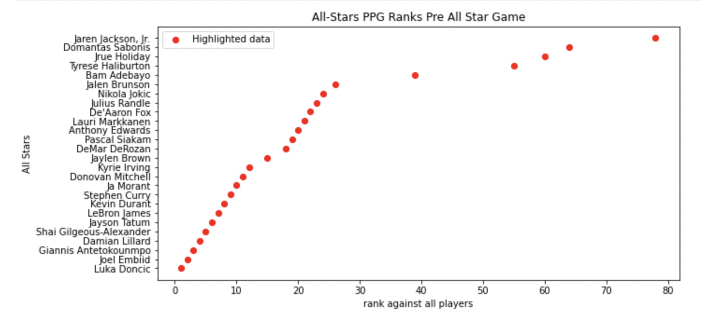
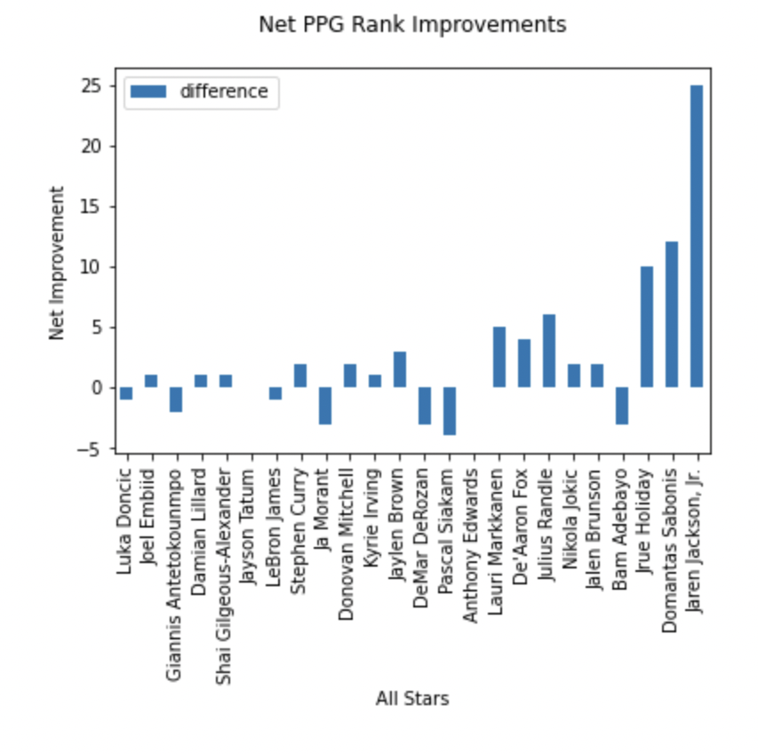
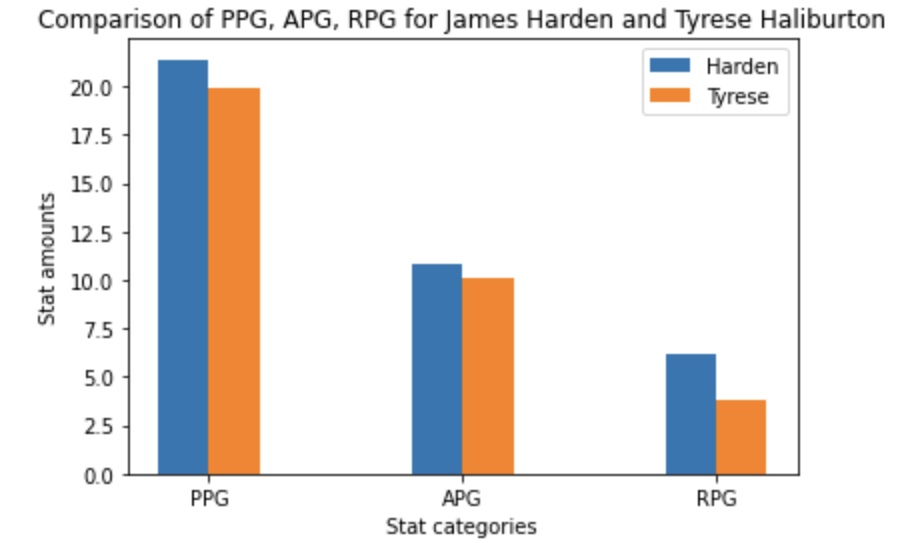
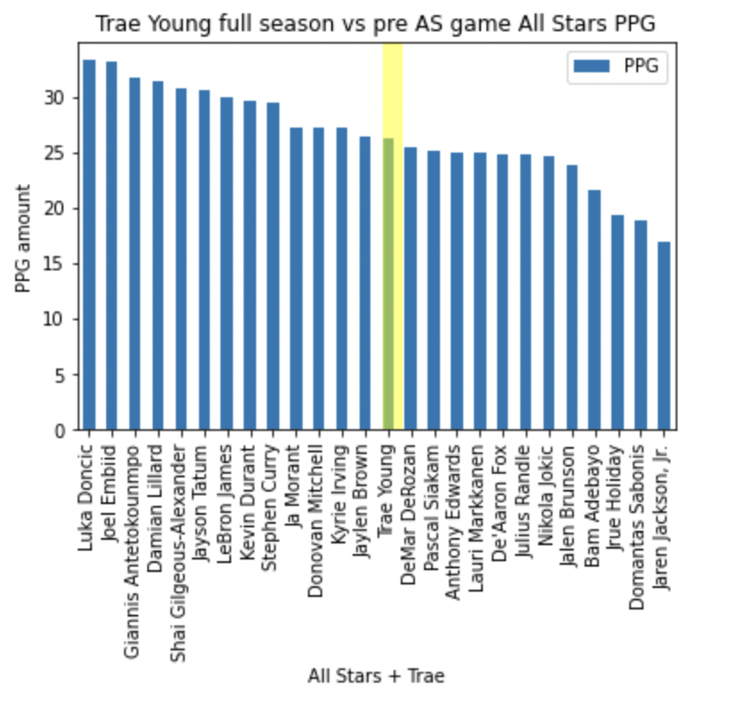
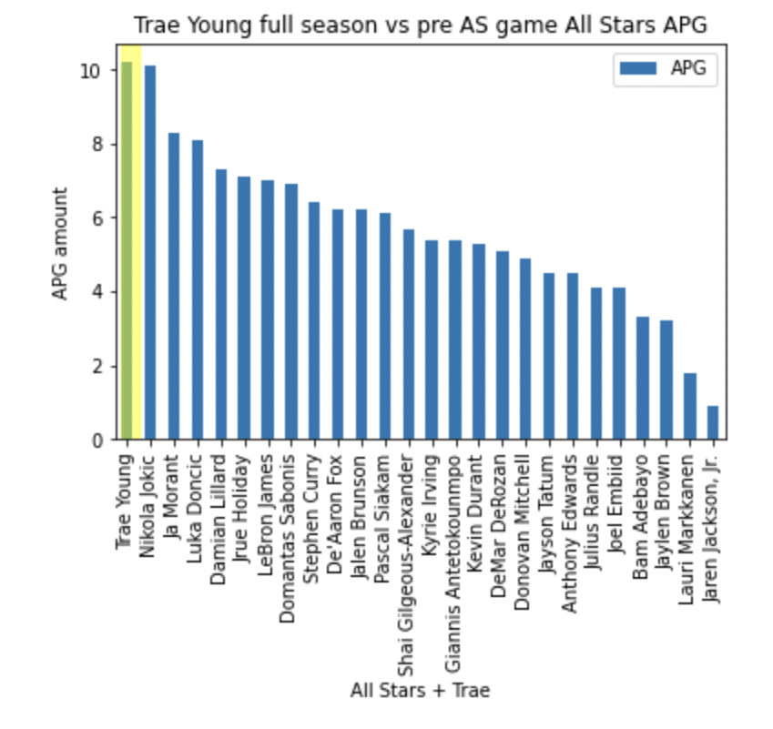

## __What Does Being an All Star Really Mean?__

Sean McKeown 
5.1.2023

__All Stars__ are the top players in basketball. Flashy, fast, and fun; these players dominate on the court and earn high praise and pay. Considering all the financial and critical success that these players have, it is worth considering if the All Stars (AS) who are selected are the correct picks...

   After many considerations, I decided on analyzing the NBA ALL-STAR game selection process. Taking data from the top 100 scorers in the NBA, I went out to answer two questions regarding the All Star game:
   - Did the original AS selections get it right? As in, did they select the best players? (My thesis is no, they were not right)
   - if we considered the full season's stats for certain players, would the outcomes of the All Star game selections be different? (My thesis is yes, the all star teams would be different if we considered the full season)
  
   I chose these questions because I wanted to prove that the ALL Star game selections weren't accurate. This matters for two reasons:
   - Players are payed based off of AS game selections 
   - AS selections are used in debates of who are the best players in the league, which effects legacy and contracts
   
  To test my questions, I decided upon analyzing PPG, RPG, and APG stats from the top 100 scorers in the NBA (which includes all-stars).
  - PPG = points per game
  - RPG = rebounds per game
  - APG = assists per game
  
  Basketball fans know that these stats don't tell the whole story, but for the purposes of this project I felt it necessary to limit the data pool due to the insanely large amount of available data for NBA players. To start my analysis, I wanted to visualize the rankings of all All Stars against the field of available players as to discover which selected All Stars were outliers.
  

  

I used graphs like this one above to discover outliers regarding the three main stats. For this example, the obvious outliers were Jaren Jackson jr, Sabonis, Holiday, and Haliburton. These players were outliers, and could be considered the worst scoring selected All-Stars. I examined the other stats as well to learn the outliers for each main stat. I then compared All Stars rankings in each stat from before the All Star game to their rankings by the end of the season as to learn which players fell off post all star game.

I used graphs like this one above to see if any players had serious drop offs or changes in their rankings compared to the field, and compared to their fellow All Stars. I compared all main stats again, and I learned that despite big advances over the rest of the field (huge Jaren Jackson rise!) the All Stars didn't really change in order much with their end of season rankings. The rank changing data did support my idea that certain all stars were undeserving of their positions on the All Star team due to many players falling off or not improving.

## First Question

After this preliminary analysis, I chose three All Stars that felt the most undeserving of their selection.
- Jrue Holiday 
- Jaren Jackson Jr
- Tyrese Haliburton 

Jrue Holiday and Jaren Jackson had very underwhelming statistics, and Tyrese Haliburton didn't play enough games to finish the season. This info inspired me to compare them against the best non-all star candidate: James Harden.

When graphing the results of comparing Harden's PPG, RPG, and APG to these three player's separate PPG, RPG, and APG, the results look like this every time:

This specific graph shows Harden being better than Tyrese in every major stat. Harden also beat Jrue Holiday, and JJJ in every major stat. On top of this, Harden played almost the same amount of games as each player. These graphs and subsequent analysis answered my first question, and proved my theory true: During All Star selection, the wrong players were chosen based off of the data. 

## Second question

Moving onto the second question, I decided to compare the full season stats of three players who weren't All Stars to the pre all star game stats of the chosen all stars. This was done to try and see if these players would be deserving of the All Star nod if their full seasons were considered. 

After comparing the stats using bar graphs, it became evident that each player deserved to be an All Star over other players if their full seasons were considered. 

In the graphs above, Trae Young's full season was considerably better than multiple All Stars who were chosen. On top of Trae, Davis and Harden also proved much more potent. The three players all lead the entire field in certain statistics (APG, RPG) while posting other stats that ranked above other all star.

The data ended up supporting my thesis for the second question which was that that certain players would make the all star team over others if their full season stats were considered. 

## Final Conclusions 

Going into this project I doubted the evidence for what I was seeking would be clear. Statistics and evaluation in the NBA can be hard, but the data I found was incredibly clear. Certain players were snubbed with the original selections, and certain players performances after the All Star game made them worthy of selection if possible. 

While the All Star game is marketed as a fun and unserious event, the impacts on players is immense. Players lose out on millions in contract money, get bashed in the media, and receive accusations of falling off. 

So these huge mistakes in selection, while seemingly inconsequential, create __real world problems__.

I hope this note book has been educational, and if you leave the book with anything it is that you should always do the research yourself before relying on others selections to evaluate success.
